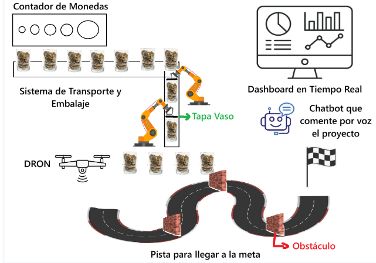
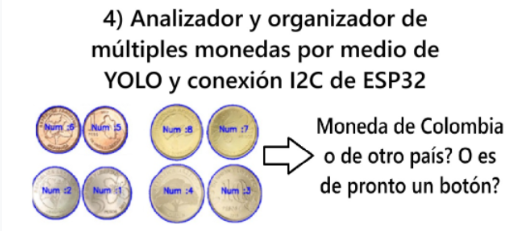

# Sistema de Logística de Monedas Inteligentes

Proyecto del segundo parcial de **Microcontroladores y Sistemas Embebidos**
— Universidad Militar Nueva Granada.

## Integrantes

| Nombre | Código |
|---|---|
| Daniel Alejandro Montaño Parra | 7004609 |
| Luis Miguel Ruiz Murcia | 7004616 |
| Maycol Stiven Arévalo Aguilar | 7004612 |

## Descripción del proyecto

Diseño e implementación de un sistema logístico de monedas inteligentes
desarrollado con ESP32, con estructuras mecánicas y electrónicas propias,
que permite la conexión inalámbrica por medio de una aplicación web en
Streamlit. El sistema integra:

- Un **contador de monedas** sobre una banda transportadora.
- Un **módulo de transporte y embalaje**, con un mecanismo que tapa el
  vaso antes de que sea recolectado.
- Un **elemento diferencial**: un analizador y organizador de monedas
  por medio de visión artificial (YOLO) y conexión I2C con el ESP32, que
  clasifica cada moneda como colombiana, extranjera, o un botón (clase
  de rechazo).
- Un **dron recolector** que levanta el vaso ya tapado y lo lleva por una
  pista con tres obstáculos hasta la meta.
- Un **dashboard en tiempo real** (Streamlit) con el seguimiento de la
  ruta, el valor de las monedas procesadas, y las variables de peso,
  cantidad y valor.
- Un **chatbot asistente** que expone los datos del proyecto (pendiente
  para una etapa posterior).

### Arquitectura general



### Elemento diferencial del grupo



> "Analizador y organizador de múltiples monedas por medio de YOLO y
> conexión I2C de ESP32" — ¿Moneda de Colombia, de otro país, o es de
> pronto un botón?

---

## Estado actual (avance del segundo parcial)

Esta etapa se centra en la **simulación completa del sistema en
PyBullet** y en el **diseño mecánico/eléctrico verificable** de la banda
transportadora y del dron, antes de pasar al montaje físico con la ESP32.

- [x] Simulación en PyBullet de la banda, la estación de visión
      (clasificador), el mecanismo tapa-vaso y el dron con pista de
      obstáculos, todo integrado en un solo script.
- [x] Dashboard en tiempo real en Streamlit, leyendo las métricas que
      genera la simulación (preparado para luego leer de la ESP32).
- [x] Memoria de cálculo completa de la banda transportadora (mecánica,
      tensión de banda, rodamientos, selección de motor, electrónica,
      sensores, control) con presupuesto de referencia y económico.
- [x] Modelos CAD paramétricos de las piezas de la banda (STEP y STL,
      listos para imprimir/cortar).
- [x] Esquemas eléctricos de la banda (potencia, driver, señales).
- [x] Guía de diseño y cálculos del dron (empuje, carga máxima,
      geometría del frame, autonomía).
- [ ] Conexión real con la ESP32 (I2C del módulo de visión + control de
      motores) — próxima etapa.
- [ ] Chatbot de voz que expone los datos del proyecto.
- [ ] Montaje físico.

---

## Estructura del repositorio

```
Parcial/
├── 01_simulacion_pybullet/   Simulación completa + dashboard
├── 02_banda_transportadora/  Diseño, CAD, cálculos y electrónica de la banda
├── 03_dron/                  Guía de diseño y cálculos del dron
├── docs/                     Figuras de la arquitectura del proyecto
└── video/                    Enlace al video de demostración
```

### `01_simulacion_pybullet/`

Simulación completa en PyBullet: banda transportadora + estación de
visión (clasificador YOLO, por ahora simulado) + mecanismo que tapa el
vaso + dron que lo recoge y lo lleva por la pista con obstáculos hasta
la meta. Cada 30 pasos de simulación escribe `estado_sistema.json` con
las métricas (monedas por clase, valor total, peso total, vasos
entregados), que lee el dashboard de Streamlit.

```bash
pip install -r requirements.txt

# Terminal 1 — la simulación
python main.py

# Terminal 2 — el dashboard, mientras la simulación corre
streamlit run streamlit_dashboard.py
```

Archivos:
- `main.py` — simulación completa (banda, tapa, dron, métricas).
- `maqueta.urdf` — modelo de la banda + estación de visión + bandejas +
  mecanismo tapa-vaso, construido sobre el URDF base entregado por el
  docente.
- `streamlit_dashboard.py` — dashboard en tiempo real.
- `estado_sistema_ejemplo.json` — ejemplo del archivo que genera la
  simulación (el real, `estado_sistema.json`, no se versiona).

### `02_banda_transportadora/`

Paquete de diseño **paramétrico y verificable** del módulo de
transporte: cambias un número, y el CAD, los cálculos y la selección de
componentes se recalculan solos. Incluye memoria de cálculo completa
(mecánica, tensión de banda, rodamientos, motor, electrónica, sensores,
control), presupuesto (referencia y económico), modelos CAD (STEP/STL) y
esquemas eléctricos. Ver el `README.md` de esa carpeta para el detalle
completo, incluyendo un hallazgo importante: la singularización de
monedas por altura no es viable cuando el rango incluye objetos más
finos que las monedas (botones), y por qué se resuelve con visión en
vez de un escalón mecánico.

### `03_dron/`

Guía de diseño y cálculos del dron que levanta el vaso con las monedas:
selección de motores brushless, empuje disponible a la altitud de Chía,
carga máxima recomendada, cuántas monedas de cada denominación puede
levantar, y geometría del frame.

### `docs/`

Figuras de la arquitectura general del sistema y del elemento
diferencial del grupo, usadas en este README.

### `video/`

El video de la demostración es pesado para GitHub; ese archivo trae las
instrucciones para añadir el enlace una vez se suba a una plataforma
externa.

---

## Próximos pasos

1. Reemplazar la clasificación aleatoria de la simulación
   (`clasificar_moneda_YOLO()` en `main.py`) por la inferencia real del
   modelo YOLO entrenado, conectada por I2C al ESP32.
2. Construir los primeros módulos físicos (banda y mecanismo tapa-vaso)
   siguiendo el CAD y la memoria de cálculo de `02_banda_transportadora/`.
3. Implementar el chatbot de voz que expone los datos del proyecto.
4. Subir el video de demostración y enlazarlo en `video/README.md`.
